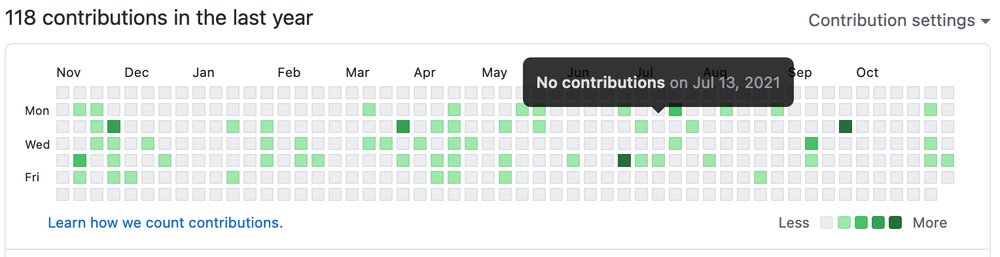
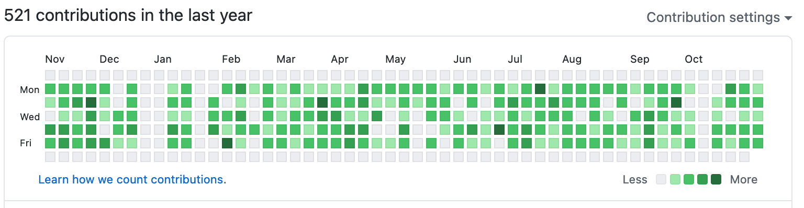

# git busy

Do you wish that this

looked like this?

Well now it can!

## Why would I want this?
Some possible reasons:
1. Maybe your boss is using the GitHub contribution graph as a performance metric, thereby punishing you for squashing your commits before every PR.
2. Maybe you want to entice employers into thinking you spend all your free time writing code.
3. Maybe your neurons activate when number goes up.

## Why did you make this?
Reason \#1. As for how I feel about this ethically, commit count is a bad performance metric and anyone using it does not deserve the privilege of accurate numbers.

## How do I use it?
1. Toss your holidays into `holidays.txt`. Can't be suspiciously working on holidays, now can we?
2. Edit the Config object in `GitBusy.scala` to set
    - start and end dates
    - timespan you normally work during a day
    - your timezone
    - distribution of commits per day you'd like to have
3. Run it with `scala GitBusy.scala` (installing scala is left as an exercise for the reader)
4. Move the generated `script.sh` into a brand new git repo
5. Run it with `sh script.sh` and wait for git to slowly generate falsified commits
6. Push that repo to GitHub. Bonus points for pushing it to a private repo and setting GitHub to show private repo activity in the contribution graph. Now no one will learn your secret!
